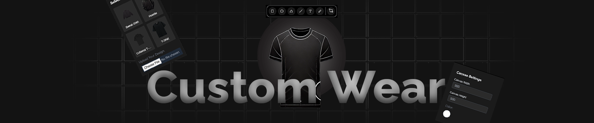
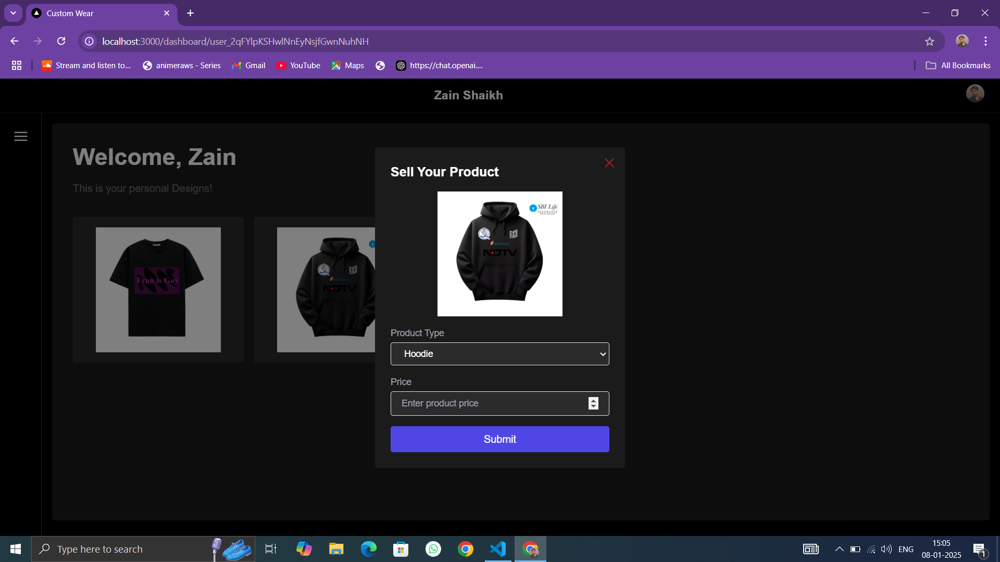
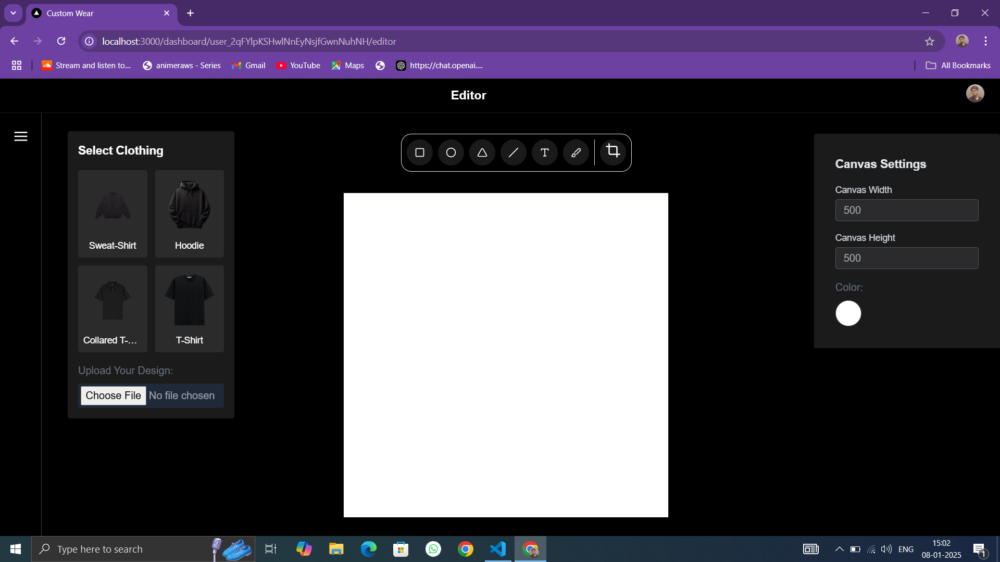
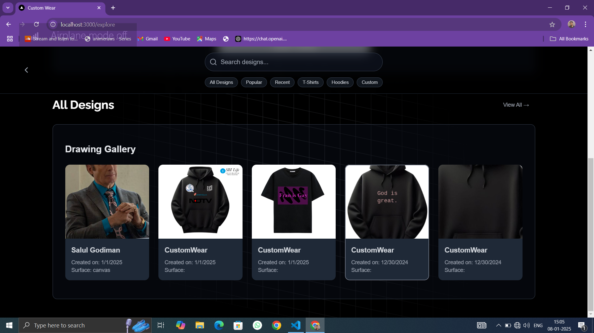

# CustomWear


CustomWear is an innovative e-commerce platform that allows users to design their own T-shirts on an interactive canvas and purchase them for printing and delivery. The project is designed to offer a seamless and engaging user experience for creating personalized clothing.

## Features

- **Custom T-Shirt Design**: Users can add text, images, and choose colors to design their T-shirts using a dynamic canvas.
- **Responsive Design**: Fully optimized for all devices, ensuring an intuitive experience across desktop and mobile platforms.
- **E-Commerce Functionality**:
  - Add to cart and checkout options.
  - Secure payment gateway integration.
  - Order history and tracking.
- **User Authentication**: Secure sign-up and sign-in using email and social media platforms.

## Tech Stack

- **Frontend**: Next.js, Tailwind CSS
- **Backend**: Node.js, Express.js
- **Database**: MongoDB
- **Others**: 

## Project ScreenShots







## Installation

To run this project locally:

1. Clone the repository:
   ```bash
   git clone https://github.com/aquib22co/CustomWear
   ```

2. Navigate to the project directory:
   ```bash
   cd customWear
   ```

3. Install dependencies:
   ```bash
   npm install
   ```

4. Start the development server:
   ```bash
   npm run dev
   ```

5. Open your browser and navigate to `http://localhost:3000`.

## Contributing

Contributions are welcome! If you have ideas for improvements or new features, feel free to fork the repository and submit a pull request.

1. Fork the repository.
2. Create a new branch for your feature:
   ```bash
   git checkout -b feature-name
   ```
3. Commit your changes:
   ```bash
   git commit -m "Add a new feature"
   ```
4. Push your branch:
   ```bash
   git push origin feature-name
   ```
5. Open a pull request on GitHub.


Feel free to reach out if you have any questions or feedback! Let's make CustomWear even better together.
